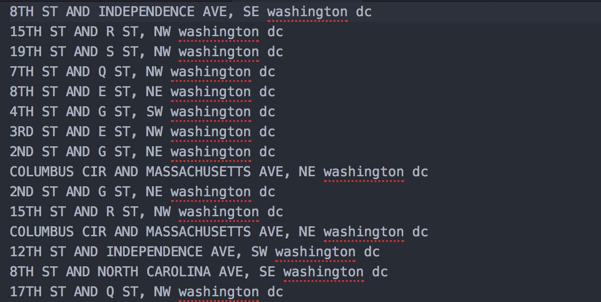
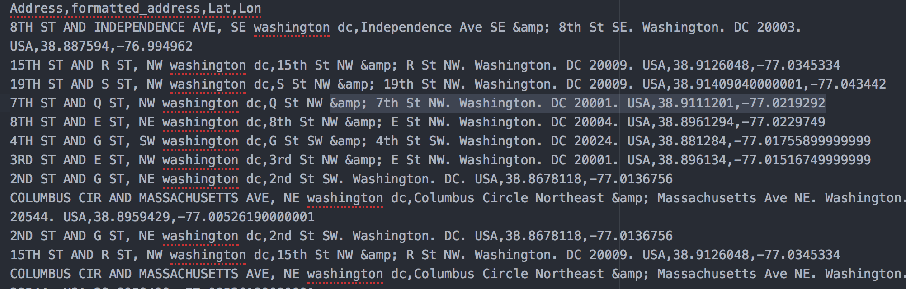

# GEO CSV
* Node application which creates csv files with formatted address and coordinates from raw address or landmarkname.
* This application can handle hundreds of data to create New CSV full of better formatted address and geo coordinates!
# before

# after

